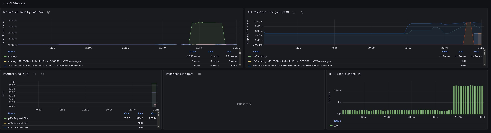
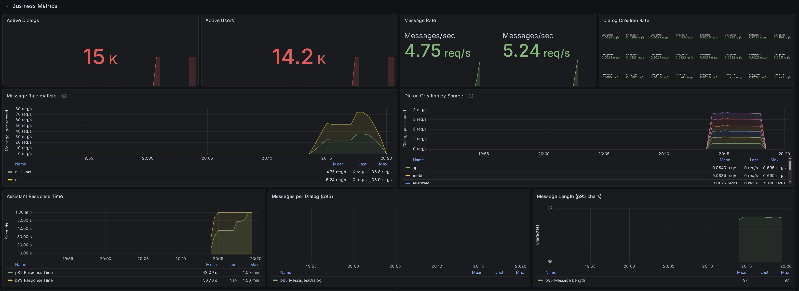
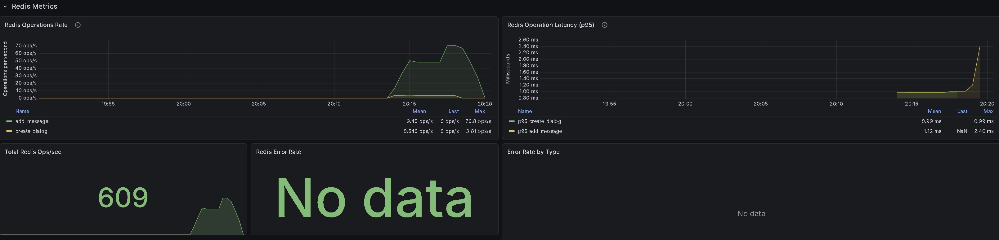
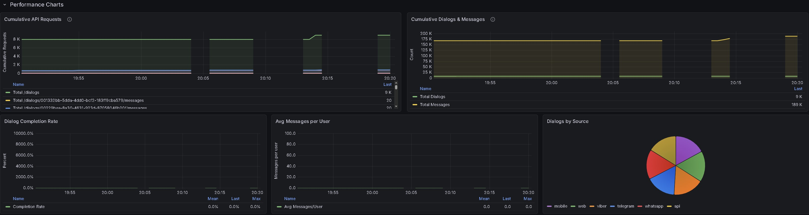

# Описание метрик Dialog Service

## Список технических метрик

Dialog Service собирает полный набор технических метрик, организованных по категориям:

### **API Метрики:**
- `dialog_api_requests_total` - количество HTTP запросов (method, endpoint, status)
- `dialog_api_request_duration_seconds` - время обработки запросов (гистограмма)
- `dialog_api_request_size_bytes` - размер запросов
- `dialog_api_response_size_bytes` - размер ответов

### **Redis Метрики:**
- `dialog_redis_operations_total` - операции Redis (create_dialog, add_message и т.д.)
- `dialog_redis_operation_duration_seconds` - время операций Redis

### **Системные Метрики:**
- `dialog_service_uptime_seconds` - время работы сервиса
- `dialog_memory_usage_bytes` - использование памяти
- `dialog_service_info` - информация о версии и окружении

### **Метрики Ошибок:**
- `dialog_errors_total` - ошибки по типам (redis_error, json_error и т.д.)

Все метрики доступны через `/metrics` эндпоинт в формате Prometheus и обновляются в реальном времени.

## Бизнес метрики (принцип RED)

Dialog Service реализует RED (Rate, Errors, Duration) паттерн для бизнес-метрик:

### **R - Rate (Скорость):**
- `rate(dialog_dialogs_created_total[5m])` - скорость создания диалогов
- `rate(dialog_messages_sent_total[5m])` - скорость отправки сообщений
- `rate(dialog_new_users_total[1h])` - скорость привлечения новых пользователей

### **E - Errors (Ошибки):**
- `dialog_dialog_completion_rate` - процент завершенных диалогов
- `dialog_user_retention_rate` - процент удержания пользователей (7-дневный)
- `rate(dialog_errors_total[5m])` - скорость бизнес-ошибок

### **D - Duration (Длительность):**
- `histogram_quantile(0.95, rate(dialog_dialog_duration_seconds_bucket[5m]))` - p95 длительность диалогов
- `histogram_quantile(0.95, rate(dialog_assistant_response_time_seconds_bucket[5m]))` - p95 время ответа ассистента
- `histogram_quantile(0.95, rate(dialog_messages_per_dialog_bucket[5m]))` - p95 сообщений в диалоге

### **Дополнительные бизнес-метрики:**
- `dialog_active_dialogs` - количество активных диалогов
- `dialog_active_users` - количество активных пользователей
- `dialog_avg_messages_per_user` - среднее количество сообщений на пользователя
- `dialog_message_length_chars` - длина сообщений

# Скриншоты
## 📊 1. API Metrics
Метрики HTTP запросов к API сервиса

## 👥 2. Business Metrics
Бизнес-показатели использования сервиса

## 🔴 3. Redis Metrics
Метрики операций с Redis

## ⚡ 6. Performance Metrics
Метрики производительности

